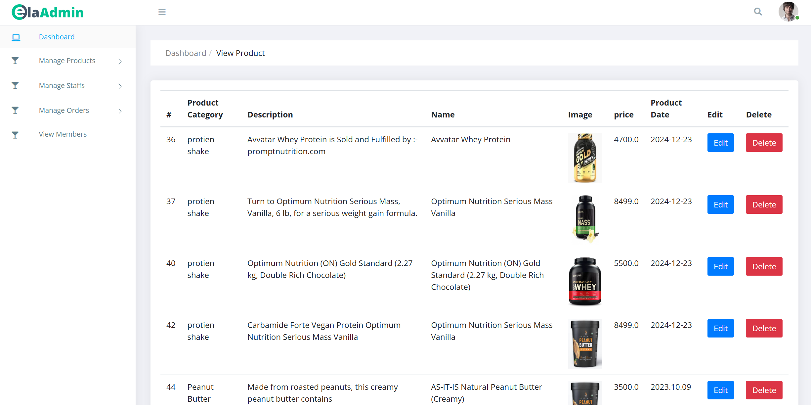
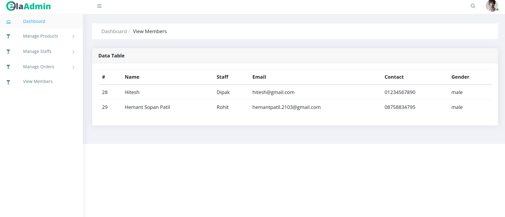
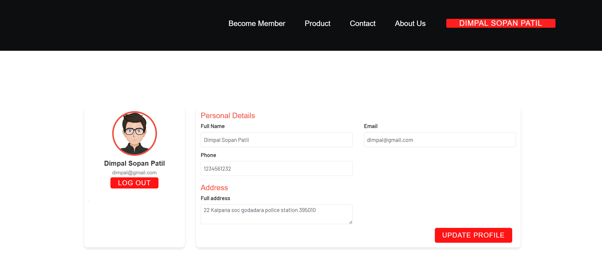

<p align="center">
  
</p>

<h1 align="center">🏋️‍♂️ Gym Management System</h1>
<h3 align="center">⚡ Jakarta EE • JSF • JPA • Payara • MySQL ⚡</h3>

<p align="center">


</p>

---

## 🧠 About Project

> ⚡ A **modern enterprise gym management system** built using Jakarta EE technologies.  
> Designed to manage gym operations efficiently with performance, security, and scalability.

✔ Member Management  
✔ Trainer Management  
✔ Membership Plans  
✔ Payment Tracking  
✔ Secure Authentication  
✔ Admin Dashboard  

---

## 🚀 Features

```diff
+ Member Registration & Records
+ Trainer Management
+ Membership Plan Control
+ Payment Monitoring
+ Secure Login System
+ Database Integration
+ Admin Dashboard
```

---

## 🛠 Tech Stack

| Layer          | Technology |
| ------------   | ---------- |
| ⚙ Backend     | Jakarta EE |
| 🎨 Frontend   | JSF        |
| 🗄 ORM         | JPA        |
| 🚀 Server     | Payara     |
| 💾 Database   | MySQL      |
| 🔧 Build Tool | Maven      |
| 💻 Language   | Java       |


---

## 📷 Screenshots

### 🔐 Login Page


### 📊 Dashboard


### 👥 Member Management


### 💳 Payment System


### 📋 Membership Plans


---

## ⚙ Installation & Setup

### 1️⃣ Clone Repository

```bash
git clone https://github.com/yourusername/gym-management-system.git
```

### 2️⃣ Import Project

✔ Open **NetBeans / IntelliJ**  
✔ Import as **Maven Project**

### 3️⃣ Create Database

```sql
CREATE DATABASE gymdb;
```

Update **persistence.xml**

```xml
<property name="jakarta.persistence.jdbc.user" value="root"/>
<property name="jakarta.persistence.jdbc.password" value="yourpassword"/>
```

### 4️⃣ Run on Payara Server

Start server and open:

```
http://localhost:8080/GymManagementSystem
```

---

## 🔑 Default Login

```
Username: admin
Password: admin123
```

---

## 📂 Project Structure

```
src/main/java      → Business Logic & Entities
src/main/webapp    → JSF Pages
resources          → Configuration files
```

---

## 🔮 Future Enhancements

✔ Online payment gateway  
✔ QR attendance system  
✔ Mobile app integration  
✔ Reports & analytics  
✔ Email notifications  

---

## 👨‍💻 Author

**Gavali197**  
🚀 Java Developer | Full Stack Learner  

---

## ⭐ Support

If you like this project:

⭐ Star the repo  
🍴 Fork it  
📢 Share it  

---

<p align="center">
  
</p>
